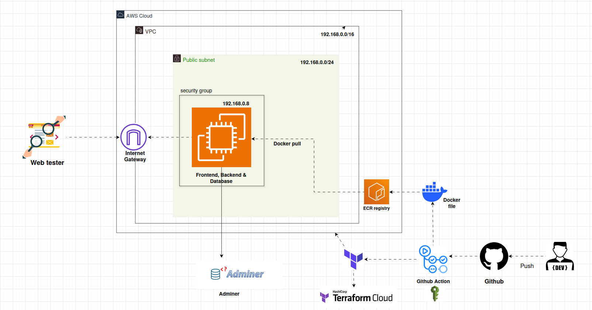

# Containerized Three-Tier Architecture (Development Setup)

This repository contains the Terraform code and automated CI/CD pipeline for provisioning and running a decoupled three-tier application stack on AWS.

The environment runs on an EC2 instance managed keylessly via AWS Systems Manager (SSM). Infrastructure provisioning is handled by Terraform with HCP Terraform (Terraform Cloud) storing the remote state, while Docker image builds and remote deployments run automatically through GitHub Actions.

## Architecture

 

### The Workflow

1. A push or PR merge to the `dev` branch triggers GitHub Actions.
2. Terraform runs `plan` and `apply` against HCP Terraform to provision or update the VPC, ECR repos, IAM roles, and EC2 instance.
3. GitHub Actions builds the frontend and backend images and pushes them to private Amazon ECR repositories.
4. The runner captures the dynamic EC2 Instance ID from Terraform outputs and triggers `aws ssm send-command`.
5. The EC2 instance pulls the updated images from ECR and spins up the stack with Docker Compose, injecting sensitive environment variables directly into memory without saving any `.env` file to disk.

## Security Overview (Dev vs Production)

This environment avoids opening port 22 for SSH by using AWS SSM Agent for remote orchestration and in-memory injection for runtime variables.

For a production rollout, consider these standard upgrades:

* **Authentication:** Swap static IAM access keys in GitHub Secrets for OpenID Connect (OIDC) to use short-lived AWS STS tokens.
* **Secrets Management:** Migrate application secrets and database credentials from GitHub Secrets to AWS Secrets Manager or SSM Parameter Store so the instance reads them dynamically at runtime through its IAM instance profile.

## Infrastructure Details

The infrastructure code under `main.tf` and `modules/` provisions:

* **VPC & Subnets:** Custom CIDR block (192.168.0.0/16) with required route tables and internet gateway.
* **Compute:** Single `t3.micro` instance running Ubuntu 24.04 LTS with an 8 GB GP3 root volume.
* **Security Group:** Inbound traffic restricted to web ports only (ports 80 and 8080). Port 22 (SSH) is completely closed.
* **IAM Instance Profile:** Attached role with `AmazonSSMManagedInstanceCore` and `AmazonEC2ContainerRegistryReadOnly` so the instance can pull from ECR and accept SSM deployment commands.
* **State Management:** HCP Terraform workspace for remote locking and state storage.

---

## Step-by-Step Setup & Deployment Guide

Follow this step-by-step walkthrough to clone, configure, deploy the infrastructure, and access the live application endpoints.

### Step 1: Fork or Clone the Repository

Clone this repository to your local development machine:

```bash
git clone <YOUR_REPOSITORY_URL>
cd <YOUR_REPOSITORY_NAME>

```

---

### Step 2: Configure HCP Terraform (Terraform Cloud)

1. Log in to [HCP Terraform (app.terraform.io)](https://www.google.com/search?q=https://app.terraform.io).
2. Create a new Organization (or select an existing one).
3. Create a new Workspace using the **CLI-driven workflow**.
4. Generate a User API Token by navigating to **User Settings > Tokens > Create an API token**. Save this token for your GitHub Secrets.
5. In your local repository root, update `providers.tf` with your specific organization and workspace names:

```hcl
terraform {
  required_version = ">= 1.0"

  cloud {
    organization = "<YOUR_HCP_ORGANIZATION_NAME>"

    workspaces {
      name = "<YOUR_HCP_WORKSPACE_NAME>"
    }
  }
}

```

---

### Step 3: Configure Required GitHub Actions Secrets

In your GitHub repository, navigate to **Settings > Secrets and variables > Actions** and click **New repository secret** for each of the following variables[cite: 13]:

| Secret Name | Description | Example / Note |
| --- | --- | --- |
| `TF_API_TOKEN` | User API token generated from HCP Terraform | Token from Step 2 |
| `AWS_ACCESS_KEY_ID` | IAM User access key with permissions to manage the stack | AWS IAM credential[cite: 13] |
| `AWS_SECRET_ACCESS_KEY` | IAM User secret access key | AWS IAM credential[cite: 13] |
| `AWS_REGION` | Target AWS region | e.g., `us-east-1`[cite: 13] |
| `AWS_ACCOUNT_ID` | 12-digit AWS account ID | e.g., `123456789012` |
| `DB_NAME` | MySQL database name | e.g., `pulsedb` |
| `DB_USER` | MySQL database user | e.g., `pulseuser` |
| `DB_PASSWORD` | MySQL user password | Secure database password |
| `SECRET_KEY` | Flask application secret key | Random secret string |

---

### Step 4: Push to the `dev` Branch to Trigger the Pipeline

Create and switch to your `dev` or remain in `main` branch, commit your changes, and push them to GitHub[cite: 11]:

```bash
git add .
git commit -m "Configure workspace and trigger initial deployment"
git push -u origin dev or main

```

---

### Step 5: Monitor the CI/CD Pipeline & Retrieve the Live Public IP

1. Go to the **Actions** tab in your GitHub repository.
2. Select the actively running workflow run (`Build and Deploy Container`).
3. Expand the **Terraform Apply** step in the deployment logs.
4. Locate the `Outputs` section at the end of the step to find the dynamic public IP address:

```text
Outputs:

ec2_public_ip = "54.xxx.xxx.xxx"
ec2_instance_id = "i-0abcd1234ef56789"

```

---

## Service Endpoints

Once the deployment finishes and the SSM command completes execution on the host, access the running services using the extracted EC2 Public IP:

| Service | Internal Docker Target | External Access |
| --- | --- | --- |
| **Frontend** | `frontend:80` | `http://<EC2_PUBLIC_IP>/` |
| **Backend API** | `backend:5000` | Reverse proxied via Nginx at `http://<EC2_PUBLIC_IP>/api` |
| **Database** | `db:3306` | Internal only (`pulse_network`) |
| **Adminer** | `adminer:8080` | `http://<EC2_PUBLIC_IP>:8080` |

---

## Tearing Down the Infrastructure

To destroy the provisioned AWS resources and stop billing:

1. Open `.github/workflows/cicd.yml`.
2. Update the Terraform step to run `destroy` instead of `apply`:

```yaml
- name: Terraform Destroy
  if: github.ref == 'refs/heads/dev' && github.event_name == 'push'
  run: |
    terraform destroy -auto-approve -input=false

```

3. Commit and push the change to the `dev` branch to trigger resource destruction[cite: 11].

>>>>>>> dev
